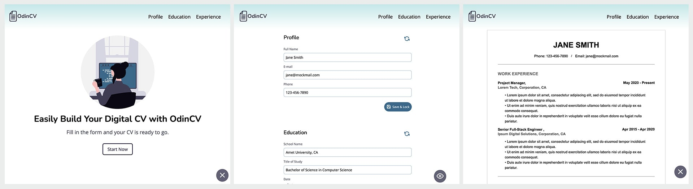

# The Odin Project: CV Application

 
  

      
  

 

This project is a **CV/Resume building application**, developed to enhance my understanding of fundamental React concepts such as **props**, **useState**, and **keys**.

For more details on this project, please visit [The Odin Project - CV Application](https://www.theodinproject.com/lessons/node-path-react-new-cv-application).

## Key Project Instructions

The application should be structured with the following key components, allowing users to input their CV information:

### Components

**Basic Information Section** 
- Name
- Phone Number
- Email

**Education Information Section**
- School Name
- Field of Study
- Period Attended

**Experience Information Section**
- Employer Name
- Position Title    
- Responsibilities
- Employment Period

**Buttons & Interactions**
- `Edit` Button: 
    Allows users to modify existing information. It can either be included in each section or act as a global edit button.

- `Preview` Button (originally required as “Submit” but renamed in this project):  
    Provides a preview of the CV .

- `Save and Lock` Button (originally required as “Submit” but renamed in this project):  
    Saves form data and renders it into HTML elements.

### Project Structure

**src Directory**
- components/ → Contains all React component files.
- styles/ → Contains all CSS stylesheets.

## Built With

-   HTML
-   CSS
-   JavaScript
-   React
-   Vite
-   ESLint
-   Prettier (VSC Extension)

